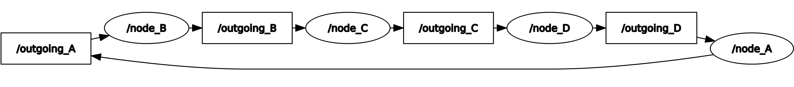
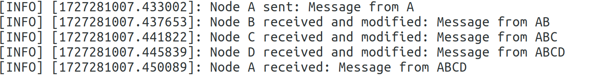

# **Homework 1 - The Telephone Game**

- Name: Neng XU
- Email: neng.xu@ensta-paris.fr

## **1. Introduction**

In this project, four ROS nodes (node_A, node_B, node_C, and node_D) are created to simulate a "Telephone Game". Each node communicates with the next one by passing a message, and each node modifies the message before forwarding it. The final node returns the modified message to the starting node. Node A initiates the message periodically every 2 seconds and logs both the original and the received modified message. The implementation uses ROS topics for communication between nodes.

## **2. Implementation**

### 2.1. Nodes:
- **Node A**: Initiates the message, starts the sequence, and prints both the sent and received messages.
- **Node B**: Receives the message from Node A, appends "B" to it, and forwards it to Node C.
- **Node C**: Receives the message from Node B, appends "C" to it, and forwards it to Node D.
- **Node D**: Receives the message from Node C, appends "D" to it, and forwards it back to Node A.

Each node is implemented as a ROS node with a publisher and a subscriber, using the following topic names for communication:
- Node A: `outgoing_A`, `incoming_A`
- Node B: `outgoing_B`, `incoming_B`
- Node C: `outgoing_C`, `incoming_C`
- Node D: `outgoing_D`, `incoming_D`

### **2.2. Node A (Starting Node)**
- **File**: `node_a.py`
- **Functionality**:
  - Node A is responsible for initiating the message and publishing it on the `outgoing_A` topic.
  - It subscribes to the `incoming_A` topic to receive the message from node D.
  - Every 2 seconds, it sends the original message and logs both the sent and received messages.
  
  ```python
  class NodeA:
      def __init__(self):
          self.pub = rospy.Publisher('outgoing_A', String, queue_size=10)
          self.sub = rospy.Subscriber('incoming_A', String, self.callback)
          self.message = "Message from A"
          rospy.Timer(rospy.Duration(2), self.timer_callback)
  ```

  - **Communication**: 
    - Publishes: `outgoing_A`
    - Subscribes: `incoming_A`
  
  - **Logging**:
    - Logs the message it sends.
    - Logs the message it receives from node D after the message completes the cycle.

### **2.3. Node B, C and D (Second, Third and Fourth Node)**
Take Node B as an example.
- **File**: `node_b.py`
- **Functionality**:
  - Node B receives the message from node A on `incoming_B` and appends "B" to it.
  - It then publishes the modified message on `outgoing_B`, forwarding it to node C.
  
  ```python
  class NodeB:
      def __init__(self):
          self.pub = rospy.Publisher('outgoing_B', String, queue_size=10)
          self.sub = rospy.Subscriber('incoming_B', String, self.callback)
  ```

  - **Communication**: 
    - Publishes: `outgoing_B`
    - Subscribes: `incoming_B`
  
  - **Logging**:
    - Logs the received and modified message.

### **2.4. Launch File**
- **File**: `homework_1.launch`
- The launch file is used to simplify the process of starting all the nodes together. It ensures that nodes B, C, and D are started first, followed by node A, which triggers the message passing sequence.

```python
<launch>
    <node name="node_B" pkg="homework_1" type="node_b.py" output="screen">
        <remap from="incoming_B" to="outgoing_A"/>
    </node>
    <node name="node_C" pkg="homework_1" type="node_c.py" output="screen">
        <remap from="incoming_C" to="outgoing_B"/>
    </node>
    <node name="node_D" pkg="homework_1" type="node_d.py" output="screen">
        <remap from="incoming_D" to="outgoing_C"/>
    </node>
    <node name="node_A" pkg="homework_1" type="node_a.py" output="screen">
        <remap from="incoming_A" to="outgoing_D"/>
    </node>
</launch>
```

### **2.5. ROS Topics and Communication Flow**

The nodes communicate using the following topics:
- Node A publishes on `outgoing_A` and subscribes to `incoming_A`.
- Node B publishes on `outgoing_B` and subscribes to `incoming_B`.
- Node C publishes on `outgoing_C` and subscribes to `incoming_C`.
- Node D publishes on `outgoing_D` and subscribes to `incoming_D`.

The message flow can be visualized as:
- `node_A -> node_B -> node_C -> node_D -> node_A`

The communication flow in `rqt_graph` is shown below.


## **3. Folder Structure**
```python
catkin_workspace/
│
├── src/
│   ├── homework_1/
│   │   ├── launch/
│   │   │   └── homework_1.launch  # Launch file for starting all nodes
│   │   ├── src/
│   │   │   ├── node_a.py          # Node A code
│   │   │   ├── node_b.py          # Node B code
│   │   │   ├── node_c.py          # Node C code
│   │   │   └── node_d.py          # Node D code
│   │   ├── doc/
│   │   │   ├── output.png
│   │   │   └── rqt_graph.png
│   │   ├── CMakeLists.txt
│   │   └── package.xml
│
├── build/
├── devel/
└── README.md
```

## **4. How to Run:**
1. Navigate to your ROS workspace:
2. Source the workspace:
    ```
    source devel/setup.bash
    ```
3. Launch all nodes using the provided launch file:
    ```
    roslaunch homework_1 homework_1.launch
    ```
    You can get the output in terminal as shown below.
    
4. Use `rqt` or `rostopic` to monitor the message flow between nodes.
